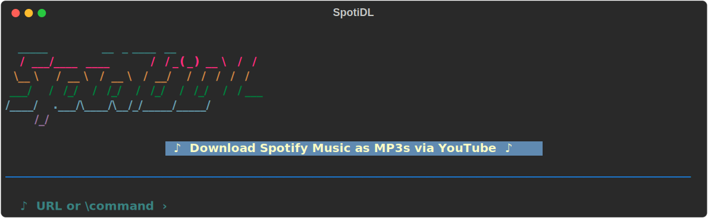
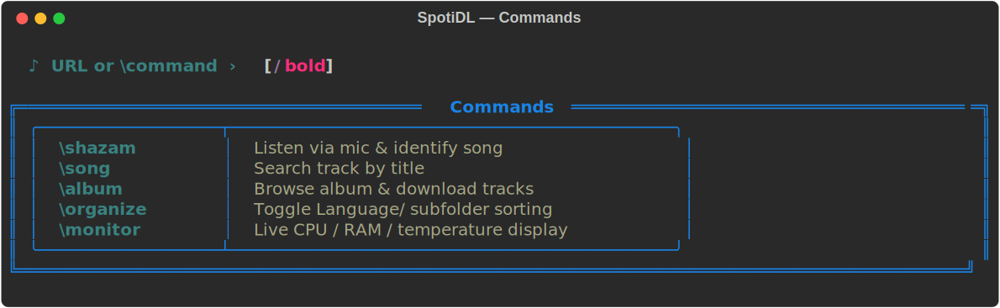
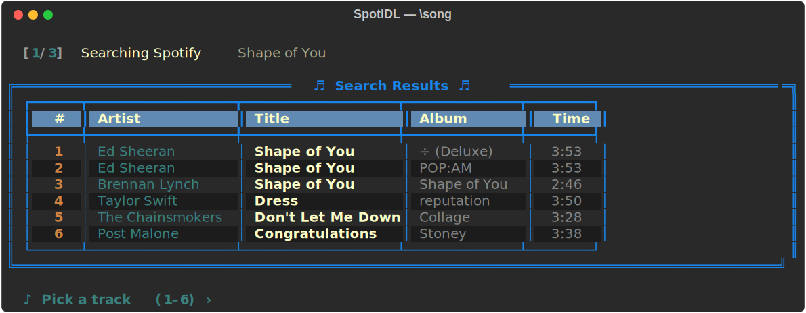
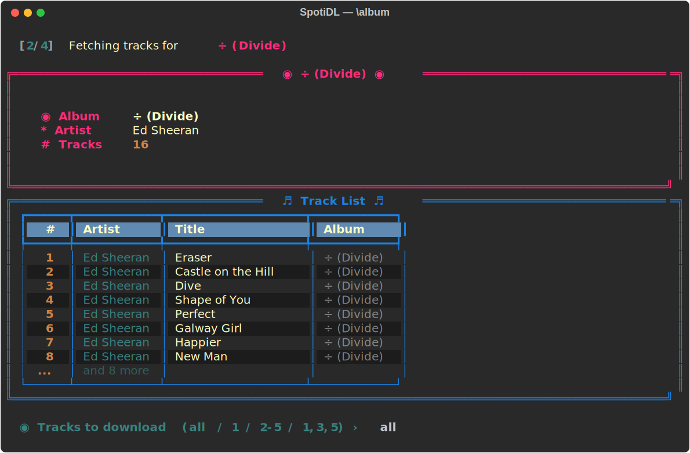
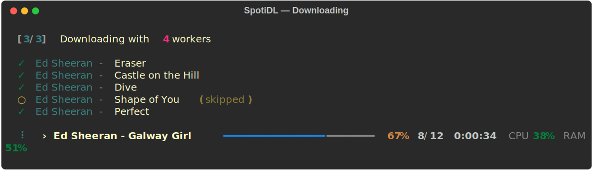
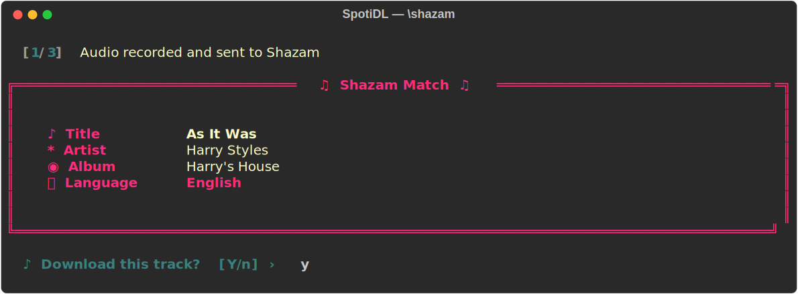
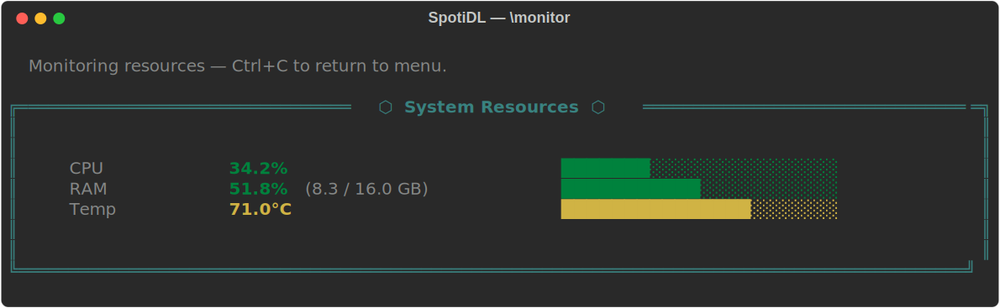
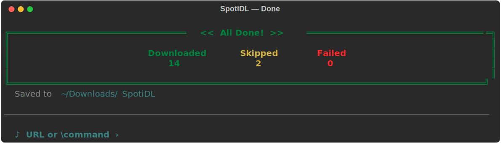

# SpotiDL

A terminal app for downloading Spotify playlists, albums, and tracks as MP3s via YouTube — with song identification via Shazam, smart language detection, and a live resource monitor.

---

## Screenshots

### Welcome screen


### \ Commands — autocomplete dropdown


### `\song` — search a track by title


### `\album` — browse and download an album


### Download in progress — parallel workers + live CPU/RAM stats


### `\shazam` — identify a playing song via microphone


### `\monitor` — live system resource panel


### Completion summary


---

## Features

- **Spotify + YouTube** — paste any Spotify playlist, album, or track URL, or a YouTube video/playlist URL
- **`\song`** — search Spotify by title, pick from results, download instantly
- **`\album`** — search for an album, browse all tracks, download all or a selection (`1`, `2-5`, `1,3,5`)
- **`\shazam`** — hold your device near a speaker, record 10 seconds, identify the song via Shazam's API, then download it
- **`\organize`** — toggle Language-based subfolder sorting (`English/`, `Spanish/`, `Korean/`, …)
- **`\monitor`** — live CPU %, RAM %, and CPU temperature display
- **Parallel downloads** — auto-scales up to 4 workers; configurable with `--jobs`
- **Language detection** — fetches lyrics via lyrics.ovh and runs `langdetect` to identify the song's language
- **MP3 tagging** — writes ID3 tags (title, artist, album, year, track number, cover art) with `mutagen`
- **Persistent session** — the app stays open after each operation; ESC goes back to the main prompt
- **403 bypass** — uses YouTube's Android client to avoid bot detection without needing a PO token

---

## Installation

### 1. Clone the repo

```bash
git clone https://github.com/vikrampruthvi5/spotify-dl.git
cd spotify-dl
```

### 2. Add Spotify credentials

Create a `.env` file in the project root:

```
SPOTIFY_CLIENT_ID=your_client_id
SPOTIFY_CLIENT_SECRET=your_client_secret
```

Get credentials at [developer.spotify.com/dashboard](https://developer.spotify.com/dashboard) — create an app and copy the Client ID and Secret.

### 3. Run the installer

```bash
bash install.sh
```

This installs all Python dependencies, registers the `dj` command, and creates `~/Applications/DJ.app` for Spotlight.

### 4. Install ffmpeg (required for audio conversion)

```bash
brew install ffmpeg
```

---

## Usage

### Launch the app

```bash
# Terminal
dj

# macOS Spotlight
Cmd+Space  →  type DJ  →  Enter
```

### Pass a URL directly

```bash
dj https://open.spotify.com/playlist/...
dj https://open.spotify.com/album/...
dj https://open.spotify.com/track/...
dj https://www.youtube.com/watch?v=...
dj https://www.youtube.com/playlist?list=...
```

### Interactive mode

Type `\` at the prompt to see the command dropdown, then select:

| Command | What it does |
|---|---|
| `\shazam` | Records 10 s from the mic, identifies the song via Shazam, asks to download |
| `\song` | Search Spotify by track title, pick from up to 6 results |
| `\album` | Search for an album, browse all tracks, select which to download |
| `\organize` | Toggle Language/ subfolder sorting on/off |
| `\monitor` | Open live CPU / RAM / temperature panel |

**Navigation:** ESC at any prompt returns to the main menu. ESC at the main prompt exits. Ctrl+C exits from anywhere.

---

## CLI flags

| Flag | Default | Description |
|---|---|---|
| `-o / --output` | `~/Downloads/SpotiDL` | Output directory |
| `-q / --quality` | `320` | MP3 bitrate (`128`, `192`, `256`, `320`) |
| `-j / --jobs` | auto (≤ 4) | Parallel download workers |
| `--browser` | — | Use browser cookies to bypass 403 errors (`chrome`, `firefox`, `safari`, `brave`, …) |
| `--organize` | off | Sort into `Language/Artist - Title.mp3` subfolders |
| `--shazam` | — | Listen via mic and download identified song |
| `--shazam-file PATH` | — | Identify from an existing audio file |
| `--listen-duration` | `10` | Seconds to record for `--shazam` |

---

## Folder structure with `--organize` / `\organize`

```
~/Downloads/SpotiDL/
├── English/
│   ├── Ed Sheeran - Shape of You.mp3
│   └── Harry Styles - As It Was.mp3
├── Spanish/
│   ├── Bad Bunny - Tití Me Preguntó.mp3
│   └── J Balvin - Con Altura.mp3
└── Korean/
    └── BTS - Spring Day.mp3
```

---

## Requirements

- Python 3.9+
- ffmpeg (`brew install ffmpeg`)
- Spotify Developer credentials (free) — needed for `\song`, `\album`, and Spotify URL downloads
- Internet connection

All Python packages are installed automatically by `install.sh`:

```
spotipy, yt-dlp, mutagen, rich, pyfiglet, requests,
python-dotenv, prompt_toolkit, shazamio, sounddevice,
scipy, langdetect, psutil
```

---

## Regenerate screenshots

```bash
python3 _gen_screenshots.py
```
